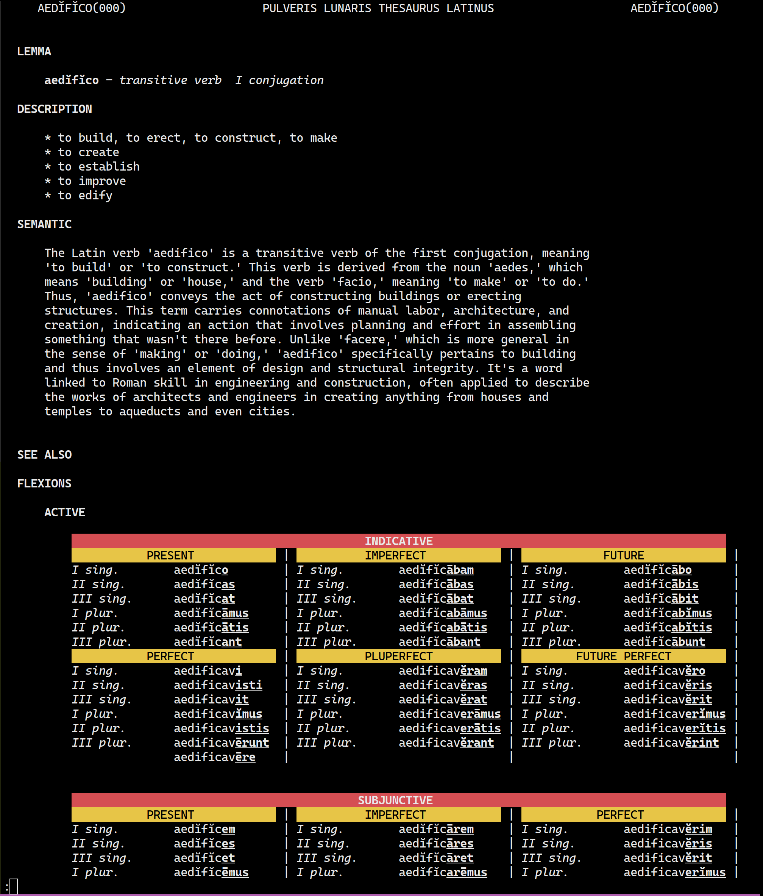

# Pulveris Lunaris Thesaurus Latinus

## Exordium

Instrumentum rogandi verba latina instrumento Python aedificatum studio latino est, ut facultates possidet

+ Ad verbum rogandum
+ In inverse ad verbum rogandum
+ Ad significationes verbi rogandos
+ Ad explicandos verborum cogitandos machina congitandae (gpt-o4)
+ Ad flexi verborum rogandos
+ Ad verba similium rogandos

## Mandatum
Creas nomine "apikey" pretio ab "OpenAI" si machina congitandae velis cogitare explicandos verborum.

## Gratia
Lunaixsky (Pulveris Lunaris)